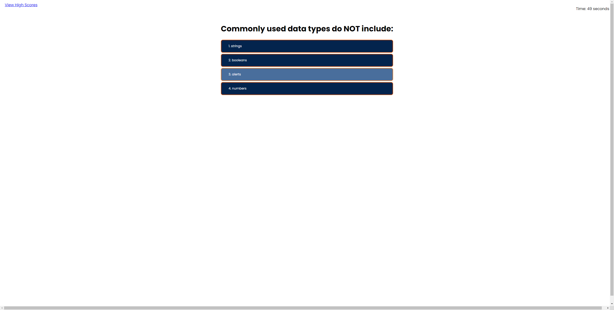

# Javascript Quiz

## Description

This project is a timed quiz on the basics of JavaScript. My motivation for building this project was to help me learn some of the finer points of JavaScript. As Javascript is a very technical language, this quiz should help students with some of the basics of Javascript

## Installation

Installation is not required for this application. You will just need to load the URL into your browser to access the application. 

## Usage

To access the application, please type the URL into your browser or follow this link: https://thomasjshea.github.io/JavaScript-Quiz/

Once you load the URL into your browser, you click the start button to begin the quiz. The timer will count down from 50 seconds. Each wrong answer will deduct 10 seconds from your time. Your score is your finishing time. If you complete all the questions in the alloted time, you are able to enter your initials and save your high score!

Screenshots:

## Credits

I was tutored by Ramon Sanchez. He helped me to get the project off the ground

I watched a very helpful Youtube video from Web Dev Simplified and used several of the strategies he used in the video.
Link: https://www.youtube.com/watch?v=riDzcEQbX6k

## License

This application uses the MIT License
